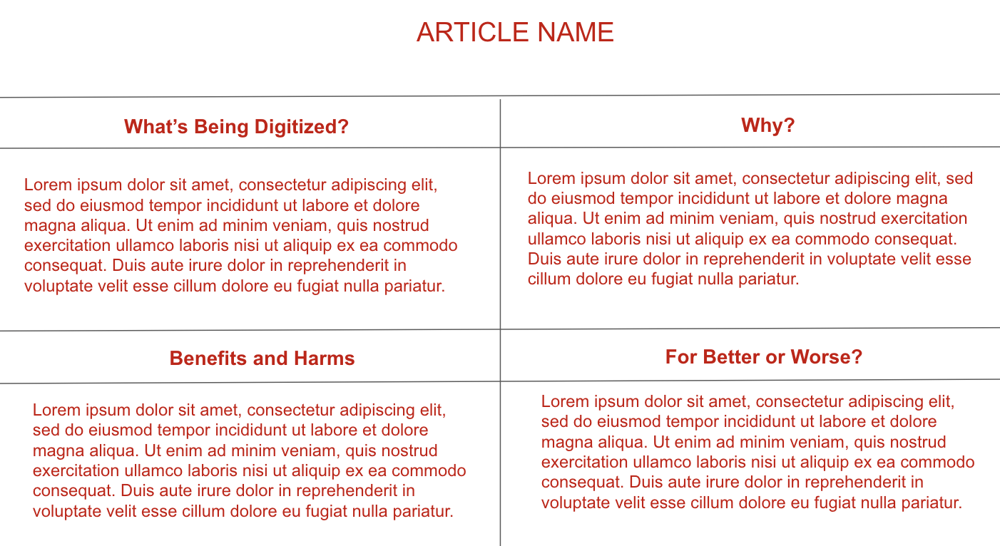

# Instructions  

  ** THIS IS A GROUP PROJECT **
  - Minimum 5 pages
    - 1 Homepage
    - 3 Different Articles addressing a Digital Dilema
    - 1 page for Anotated articles / Brainstorm / Wireframe
    -  Digital Dilema [ Article 1](https://www.todayonline.com/world/athletes-dont-own-their-tattoos-thats-problem-video-game-developers)
    -  Digital Dilema [ Article 2](https://www.bleepingcomputer.com/news/security/dna-testing-kits-and-the-security-risks-in-digitized-dna/)
    -  Digital Dilema [ Article 3](https://mediaengagement.org/research/the-ethics-of-computer-generated-actors/) 

  
  ## The Homepage must have:
  
  1. Good HTML structure using most of:```<!DOCTYPE> <html><head><title><body><p><h1><h2><a href><ol><ul><li><div><table> -minimum 4X4 size```
  2. Pleasing to the eye Style (External CSS)
  3. Identifier such as Banner with info, Favicon, etc.
  4. Navigation to each of Article's page and Prep Work page.
  5. Brief summary of what the group did and learn as a whole
  6. Note of each team member roles and responsabilities


  ## Individual Team member page needs to: 

  1. Create a separate HTML Document
  2. Name the file after Article they Read
  3. Use same group banner
  4. Needs to take a stand on each question, using the article to help support your position.
  5. The page should contain a Table to display  your answers. For example:  
  6. Find creative ways to represent the information in each quadrant. i.e: (Images/ Emojis / Style(color, font, background, border, etc))
  7. Bellow the table the cited anottated article.

  
## Brainstorm / Wireframe page

  1. Describes your team creative thinking proccess.
  2. Screenshots of any wireframes or drafts
  3. Explain how did the team distributed the work
  4. Expalin what what does your team feel the most proud of?
  5. Explain what your team found the most difficult about the project
     
 

  